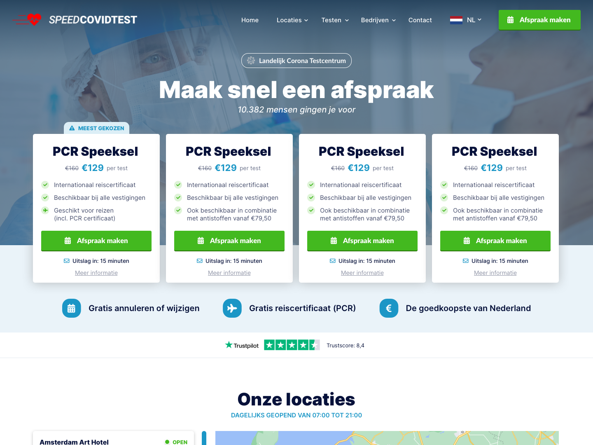
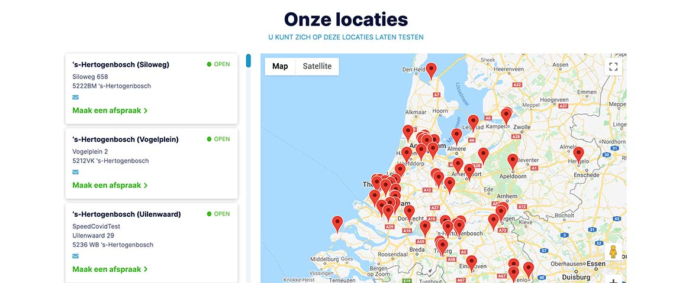
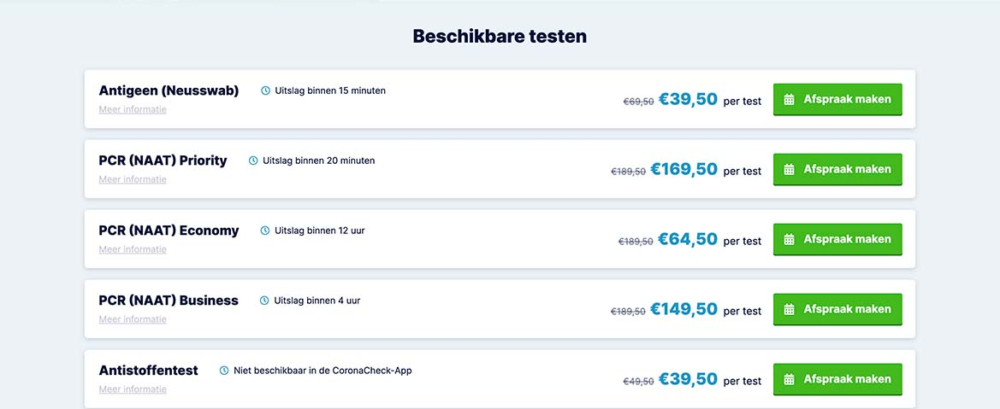
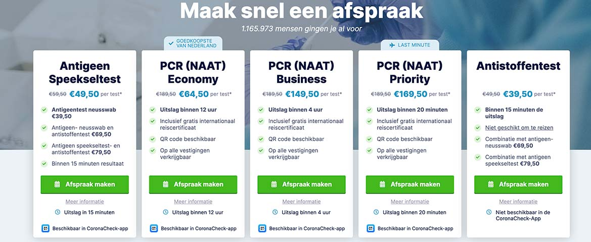

# WordPress Custom Theme - SpeedCovidTest



Welcome to the SpeedCovidTest WordPress custom theme! This theme is designed with a focus on speed, flexibility, and customization. It incorporates Advanced Custom Fields (ACF), SCSS for styling, custom templates, custom fonts, reusable global templates, and a Gulpfile for compiling files.

## Table of Contents

- [Installation](#installation)
- [Features](#features)
- [Screenshots](#screenshots)
- [Developer Information](#developer-information)

## Installation

1. **Clone the Repository:**
   ```bash
   git clone https://github.com/izhan47/wordpress-custom-theme-speedcovidtest.git
   ```

2. **Navigate to the Theme Directory:**
   ```bash
   cd wordpress-custom-theme-speedcovidtest
   ```

3. **Install Dependencies:**
   ```bash
   npm install
   ```

4. **Compile Assets:**
   ```bash
   gulp
   ```

5. **Activate the Theme:**
   - Log in to your WordPress admin panel.
   - Go to "Appearance" > "Themes."
   - Activate the "SpeedCovidTest" theme.

## Features

- **Advanced Custom Fields (ACF):** Leverage ACF for flexible content creation.
- **SCSS Styling:** Organized and modular SCSS for easy theming and customization.
- **Custom Templates:** Unique templates to enhance the visual appeal.
- **Custom Fonts:** Integrate custom fonts for a distinctive look.
- **Reusable Global Templates:** Build consistent design elements across the site.
- **Gulpfile:** Streamline development with Gulp for efficient file compilation.

## Screenshots


_All Locations_


_Available Tests_


_Hero Products_

## Developer Information

- **Developer:** M Izhan
- **Email:** [izhan47@gmail.com](mailto:izhan47@gmail.com)
- **Website/Support:** [izhan.me](https://izhan.me)
- **Repository URL:** [GitHub - SpeedCovidTest](https://github.com/izhan47/wordpress-custom-theme-speedcovidtest)

Feel free to explore, customize, and contribute to the development of this WordPress custom theme! If you encounter any issues or have suggestions, please open an issue on the GitHub repository.